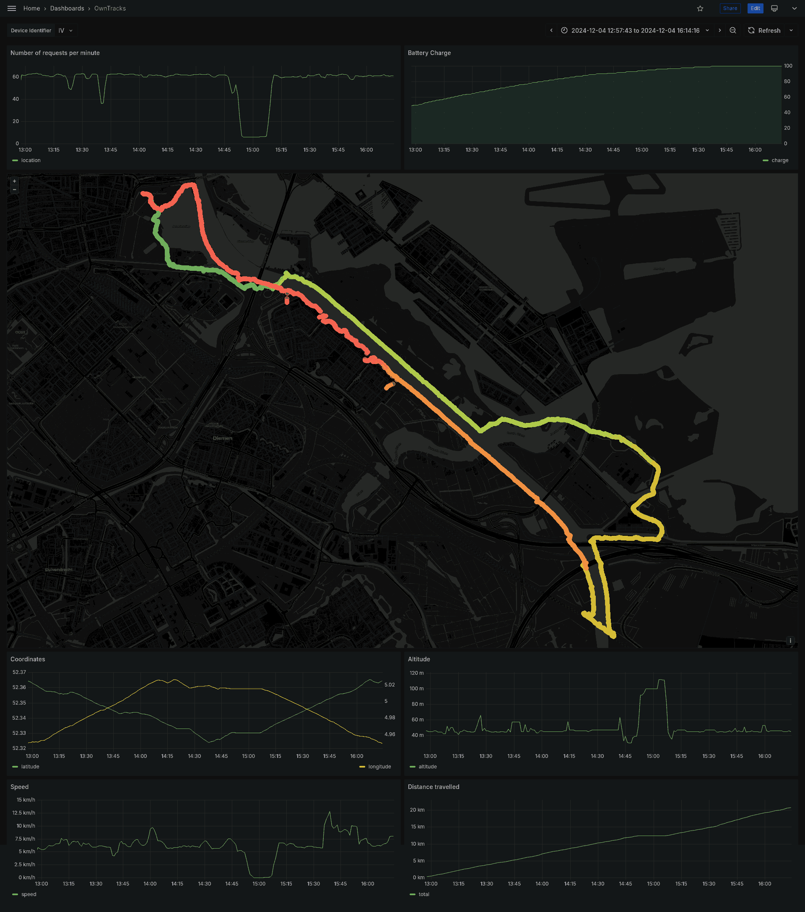

Owntracks to Prometheus relay
=============================

This is a very simple [OwnTracks Recorder](https://owntracks.org/) replacement,
which simply passes the data received to Prometheus. This can be later used to
display the location in Grafana.

**NOTE:** This works perfectly well when your devices are always connected to
the network. However, Prometheus will only accept data points at most 1 hour
in the past. If your device was not connected for over 1 hour the data gathered
will be lost. For this reason, I am abandoning this solution, at least until
I figure out how to make Prometheus accept older data.

Requirements
------------

1. HTTP server like nginx or Apache httpd
2. uWSGI application server, with psgi plugin
3. Prometheus
4. Grafana

Installation
------------

On Arch just use makepkg to compile, then install the resulting package.

```
makepkg
sudo pacman -U ...
```

Tell systemd to listen for incoming request on the unix socket:

```
sudo systemctl start uwsgi@owntracks-prometheus-relay.socket
```

Adjust nginx configuration to relay requests to the approptiate socket.
E.g. in the server section add:

```
  location /owntracks/ {
    uwsgi_pass unix:/run/uwsgi/owntracks/prometheus/relay.sock;
    include uwsgi_params;
  }
```

Reload nginx configuration:

```
sudo systemctl reload nginx
```

Confirm that the application has started:

```
sudo systemctl status uwsgi@owntracks-prometheus-relay.service
```

If everything is correct, you should enable the socket permanently:

```
sudo systemctl enable uwsgi@owntracks-prometheus-relay.socket
```

Grafana
-------

An example grafana dashboard can be found in the `examples` directory.


